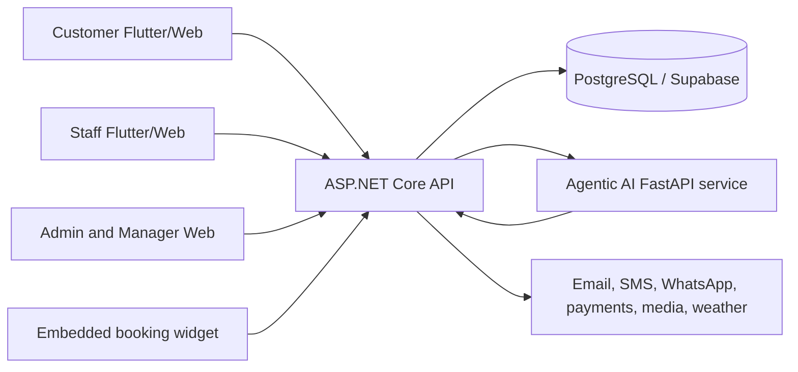
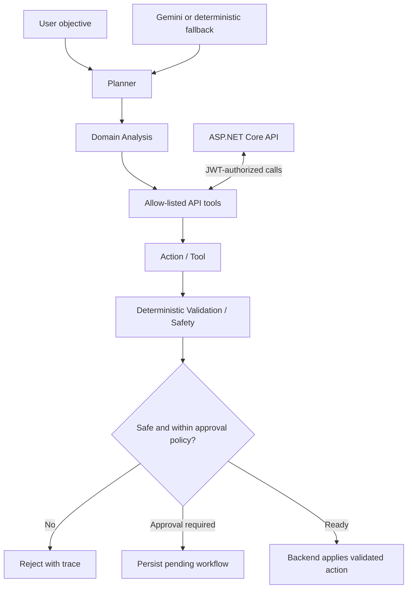
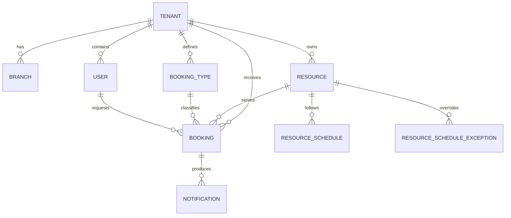

# SE3090_SE002 Universal SME Management Platform

## 1. Project Overview

The Universal SME Management Platform is a multi-tenant SaaS system for small and medium-sized businesses that need to publish services, manage resources, accept bookings, coordinate staff, and monitor operations. The same platform supports clinics, restaurants, gyms, schools, real-estate agencies, tourism operators, and general service businesses.

The platform has three client experiences backed by one API:

- A React web console for administrators, managers, staff, and customer web flows.
- A Flutter mobile application for customers and staff.
- A website booking widget that businesses can embed in their own sites.

The ASP.NET Core API is the only component that accesses PostgreSQL. This centralizes authorization, validation, tenant isolation, booking conflict detection, migrations, and audit-sensitive operations.

## 2. Business Problem and Objectives

Many SMEs rely on phone calls, spreadsheets, social-media messages, and disconnected calendars. This causes double bookings, poor resource utilization, slow customer responses, limited operational visibility, and inconsistent follow-up.

The platform addresses these problems by providing:

- A shared booking engine for time slots, nights, date ranges, and packages.
- Tenant-specific resources, branches, staff schedules, services, pricing, and rules.
- Customer self-service booking, rescheduling, cancellation, notifications, and QR check-in.
- Role-based operational dashboards for clinic, restaurant, gym, school, and tourism workflows.
- Inventory, billing, purchase-order, and reporting modules where enabled for a tenant.
- Auditable AI assistance that proposes actions but cannot bypass deterministic validation or human approval.

The design goal is reuse: a new business type should be configured through tenant and booking data wherever possible rather than requiring a separate application.

## 3. Users and Roles

| Role | Main responsibilities | Primary client |
| --- | --- | --- |
| SuperAdmin | Platform-wide tenant, user, subscription, audit, and suspension management. Protected by a separate login and TOTP. | Web platform console |
| Admin | Business setup, branches, resources, staff, services, reports, billing, inventory, and approvals. | Web and Flutter |
| Manager | Day-to-day bookings, schedules, operational dashboards, and AI workflow approval. | Web and Flutter |
| Staff | Personal schedule, check-in, assigned operational work, and role-specific dashboard views. | Web and Flutter |
| Customer | Browse businesses, select a service, book, reschedule, cancel, receive notifications, and show a QR code. | Flutter and customer web |

Customer accounts are global identities. A customer can join more than one business while each booking remains scoped to the selected tenant.

## 4. Main Features

- Multi-tenant onboarding and tenant-scoped authorization.
- Branch, resource, staff, schedule, exception, and booking-type management.
- Slot, night, date-range, and package booking units.
- Conflict detection, approval rules, recurring bookings, rescheduling, cancellation cutoffs, and QR check-in.
- Customer accounts, public tenant discovery, business profiles, notifications, and website booking widget.
- Role-based dashboards for clinics, restaurants, gyms, schools, and tourism operators.
- Billing, invoices, payment flows, insurance claims, inventory, suppliers, purchase orders, equipment, and analytics modules.
- Schedule Copilot, customer find-and-book, Billing Copilot, and inventory planning workflows.
- Platform owner console with TOTP, rate limiting, session revocation, step-up confirmation, and append-only audit records.

The deferred or integration-dependent capabilities are documented in the root README and relevant design documents. For example, external SMS, WhatsApp, email, payment, push notification, weather, travel-time, and Cloudinary services require provider credentials before they can operate fully.

## 5. Technology Justification

| Area | Technology | Reason for selection |
| --- | --- | --- |
| API | ASP.NET Core 8 Web API | Mature HTTP pipeline, dependency injection, authorization middleware, OpenAPI support, and strong team familiarity. |
| Persistence | Entity Framework Core 8 + Npgsql + PostgreSQL | Relational integrity for bookings and users, PostgreSQL JSONB for configurable business metadata, and migration support. |
| Database hosting | Supabase PostgreSQL | Managed PostgreSQL with a practical development and demonstration setup. |
| Web | React, TypeScript, Vite, Redux Toolkit, RTK Query | Component reuse, typed API contracts, predictable state management, and fast local development. |
| Mobile | Flutter and Dart | One codebase for Android, iOS, web, and desktop targets with a consistent booking experience. |
| AI service | Python, FastAPI, Pydantic, Google Gemini, httpx | Lightweight service boundary, typed request/response contracts, and straightforward test doubles for model calls. |
| Authentication | JWT bearer tokens, BCrypt, Flutter secure storage | Stateless API authentication with secure password hashing and protected mobile token storage. |
| Deployment | Render for backend services and Vercel-compatible frontend deployment | Simple container-based deployment for the API/AI services and static web delivery for the React app. |

## 6. System Architecture



The API owns authentication, tenant context, database access, business rules, booking writes, migrations, and production workflow approval. The web and mobile clients do not connect directly to PostgreSQL or Gemini.

### Request and authorization flow

1. A client authenticates through `/api/auth/login` or registers through `/api/auth/register`.
2. The API returns a JWT containing the user identity, role, and tenant context.
3. Clients send the token as `Authorization: Bearer <token>`.
4. Tenant-scoped queries apply the current tenant context and `TenantId` filters.
5. Controllers validate role and ownership rules before calling domain services.
6. Booking creation rechecks availability and conflicts immediately before persistence.

## 7. Agentic AI Architecture

The AI service is an internal FastAPI microservice. It is called by the ASP.NET Core backend using a shared internal bearer token and never connects directly to PostgreSQL.



The booking pipeline is Planner -> Domain Analysis -> Action/Tool -> Validation/Safety. The final safety agent is deterministic Python and is the only part allowed to create a booking in that pipeline. High-impact actions remain pending until an authorized manager approves them through the ASP.NET Core API. The AI service records a workflow trace containing agent steps, tool calls, validation results, and fallback information.

The service also exposes internal billing and inventory planning edges. Billing analysis remains deterministic in C# for repeatable fraud and threshold decisions; AI may interpret a request or narrate findings but cannot loosen thresholds or approve an action.

## 8. Database Design

The database uses a shared-schema, tenant-isolated model. Core entities are:



Important design decisions:

- `TenantId` is present on tenant-owned records and enforced through API query scoping.
- `Resource.CustomAttributes` and `BookingType.ConfigJson` use JSONB for business-specific fields without duplicating the schema for every industry.
- `BookingType.BookingUnit` selects `Slot`, `Night`, `DateRange`, or `Package` availability behavior.
- Booking conflicts use overlapping `DateTime` intervals, so the same persistence model works for appointments, accommodation, vehicle rental, and packages.
- EF Core migrations are stored in `backend/SmeBackend/Migrations` and are applied at application startup.
- Core booking tables use explicit lowercase snake_case names where configured; legacy/default tables may retain PascalCase names.

## 9. Repository Structure

```text
backend/SmeBackend/          ASP.NET Core API, domain models, controllers, services, migrations
backend/SmeBackend.Tests/    xUnit backend and integration tests
frontend/                    React + TypeScript web application and booking widget
mobile/sme_mobile/           Flutter application
agentic-ai-service/          FastAPI AI service, agent implementations, tools, schemas, tests
agents/                      Shared agent contracts and supporting Python code
scripts/                     PostgreSQL seed SQL and PowerShell demo-data scripts
docs/                        Architecture decisions, feature templates, reviews, and technical guides
design/                      UI kit and design material
tests/                       Root-level Python tests
```

## 10. Installation and Environment Setup

### Prerequisites

- Git
- .NET SDK 8
- PostgreSQL client tools (`psql`) and access to a PostgreSQL database
- Node.js and npm
- Flutter SDK 3 with Dart 3
- Python 3.10 or newer
- Optional: Android Studio, an Android emulator, or a physical mobile device

### Backend

```powershell
cd backend/SmeBackend
dotnet restore
$env:ASPNETCORE_ENVIRONMENT = "Development"
dotnet user-secrets set "ConnectionStrings:DefaultConnection" "Host=localhost;Port=5432;Database=SmePlatform;Username=postgres;Password=<password>"
dotnet user-secrets set "Jwt:Key" "<long-random-development-key>"
dotnet run
```

The normal development URLs are `http://localhost:5298` and `https://localhost:7218`. Swagger is available at `/swagger`. On startup, the API applies EF Core migrations and creates the development demo tenant/accounts when development seeding is enabled.

For a local AI workflow, also configure:

```powershell
dotnet user-secrets set "AgentService:BaseUrl" "http://127.0.0.1:8001"
dotnet user-secrets set "AgentService:InternalToken" "<same-token-as-ai-service>"
```

### Agentic AI service

```powershell
cd agentic-ai-service
python -m venv .venv
.\.venv\Scripts\Activate.ps1
pip install -r requirements.txt
Copy-Item .env.example .env
uvicorn main:app --host 0.0.0.0 --port 8001 --reload
```

Required `.env` values:

| Variable | Purpose |
| --- | --- |
| `GEMINI_API_KEY` | Gemini API key for live model calls. |
| `AGENT_SERVICE_INTERNAL_TOKEN` | Must match the backend `AgentService:InternalToken`. |
| `BACKEND_API_BASE_URL` | Backend API base URL used by tools, for example `http://127.0.0.1:5298/api`. |
| `GEMINI_MODEL_DEFAULT` | Optional default model override. |
| `GEMINI_MODEL_FALLBACKS` | Optional comma-separated fallback models. |

Run `python check_health.py` from this directory to check configuration and the end-to-end pipeline. Automated tests mock Gemini and do not require a live key.

### Frontend

```powershell
cd frontend
npm install
Copy-Item .env.example .env.local
npm run dev
```

Set `VITE_API_URL` in `.env.local` to the API base URL including `/api`, for example `http://localhost:5298/api`. If it is omitted, the local fallback is used. Production builds can use the Vercel rewrite in `frontend/vercel.json`.

Useful commands:

```powershell
npm run build
npm run test
npm run check:nav
npm run check:subtypes
```

### Mobile

```powershell
cd mobile/sme_mobile
flutter pub get
flutter run -d chrome --dart-define=API_BASE_URL=http://localhost:5298
```

For an Android emulator, use `http://10.0.2.2:5298`; for a physical device, use the computer's LAN address and allow inbound port 5298 through the firewall. Run `flutter test` for the mobile test suite.

### Database setup and demo data

The backend applies migrations automatically when it starts. To use a separate database manually:

```powershell
psql "<postgres-connection-string>" -f scripts/seed-demo-data.ps1
```

The main demo PowerShell scripts should be run from the repository root after the API has started, for example:

```powershell
.\scripts\seed-demo-data.ps1
.\scripts\seed-mirissa-jetliner.ps1
```

SQL seed files can be run with `psql -f`. The tourism, clinic, restaurant, gym, and school seed files are documented in the root README. Never commit real connection strings, API keys, or production credentials.

## 11. Environment Variables and Secrets

Production configuration uses ASP.NET Core environment-variable names with double underscores:

| Variable | Required for | Notes |
| --- | --- | --- |
| `ConnectionStrings__DefaultConnection` | Backend | PostgreSQL/Supabase connection string. |
| `Jwt__Key` | Backend | Long random signing key; keep stable after deployment. |
| `Jwt__Issuer` and `Jwt__Audience` | Backend | JWT validation values. |
| `AgentService__BaseUrl` | Backend AI features | Public or internal HTTPS URL of the AI service. |
| `AgentService__InternalToken` | Backend and AI service | Same secret on both services. |
| `GEMINI_API_KEY` | AI service | Never expose to clients. |
| `BACKEND_API_BASE_URL` | AI service | Backend API base URL including `/api`. |
| `Cloudinary__CloudName`, `Cloudinary__ApiKey`, `Cloudinary__ApiSecret` | Media upload | Optional until image upload is used. |
| `Integrations__SendGrid__ApiKey` | Email | Optional integration. |
| `Integrations__Twilio__AccountSid`, `AuthToken`, `FromNumber`, `WhatsAppFrom` | SMS/WhatsApp | Optional integration. |
| `Integrations__TextLk__ApiToken`, `SenderId` | SMS | Optional integration. |
| `Platform__SecretKey` | Platform console | Key used to protect TOTP secrets. |

Use `dotnet user-secrets` locally and the hosting provider's encrypted secret store in production. Do not put secrets in `appsettings.json`, `.env` committed to Git, frontend variables, seed scripts, or screenshots.

## 12. API Documentation

The complete, generated contract is available through Swagger when the backend is running:

- Swagger UI: `http://localhost:5298/swagger`
- OpenAPI JSON: `http://localhost:5298/swagger/v1/swagger.json`
- Liveness: `http://localhost:5298/health/live`
- Readiness and database check: `http://localhost:5298/health`

All application routes are under `/api` and protected routes require a JWT unless explicitly marked public. Major endpoint groups are:

| Group | Representative routes | Purpose |
| --- | --- | --- |
| Authentication | `POST /api/auth/register`, `POST /api/auth/login`, `POST /api/auth/join/{tenantId}` | Registration, login, global customer membership. |
| Tenants and profiles | `/api/tenant`, `/api/tenants`, `/api/tenant/public` | Onboarding, settings, public directory, business profiles. |
| Resources and branches | `/api/resources`, `/api/branches`, `/api/tenant/staff` | Manage bookable resources, schedules, branches, and staff. |
| Booking types | `/api/bookingtypes` | Services, durations, prices, approval rules, and booking units. |
| Bookings | `/api/bookings` | Availability, create, reschedule, cancel, check-in, status, recurring bookings, and reports. |
| Customer access | `/api/public/booking`, `/api/agent/find-and-book`, `/api/agent/workflow/mine` | Public widget and customer AI booking flow. |
| Agent workflows | `/api/agent/workflow/*`, `/api/agents/*` | Propose, inspect, approve, reject, and apply validated workflows. |
| Operations reports | `/api/reports/clinic/*`, `/api/reports/restaurant/*`, `/api/reports/gym/*`, `/api/reports/school/*` | Business-type dashboards and operational reports. |
| Billing | `/api/invoices`, `/api/billing-agent/*`, `/api/subscriptions/*` | Invoices, billing analysis, subscriptions, and payment flows. |
| Inventory | `/api/inventory/*`, `/api/suppliers/*`, `/api/purchase-orders/*` | Stock, movements, suppliers, replenishment planning, and approvals. |
| Platform console | `/api/platform/auth/*`, `/api/platform/*` | SuperAdmin login, MFA, tenant administration, subscriptions, and audit. |

For each route, Swagger is the source of truth for request DTOs, response schemas, authorization requirements, and status codes. The AI service has a separate FastAPI OpenAPI page at `http://localhost:8001/docs`.

## 13. Testing

Run the relevant suite from the repository root or component directory:

```powershell
# Backend
 dotnet test backend/SmeBackend.Tests/SmeBackend.Tests.csproj

# Frontend
cd frontend
npm run test
npm run build

# AI service
cd ../agentic-ai-service
pytest tests/ -v

# Mobile
cd ../mobile/sme_mobile
flutter test
```

The backend tests include unit and PostgreSQL/Testcontainers-backed scenarios. AI tests mock the Gemini boundary and focus on orchestration, tool permissions, deterministic safety, schema validation, and failure handling. Frontend checks include Vitest, TypeScript compilation, navigation parity, subtype registry validation, and Vite production bundling.

## 14. Deployment

### Render

`render.yaml` defines two Docker web services:

- `sme-backend`, rooted at `backend/SmeBackend`, with `/health` as the health check.
- `sme-agentic-ai`, rooted at `agentic-ai-service`, with `/health` as the health check.

Create the Render Blueprint, provide the `sync: false` secrets, and verify that `AgentService__BaseUrl`, `AgentService__InternalToken`, and `BACKEND_API_BASE_URL` agree across services. The database remains hosted in Supabase unless a different PostgreSQL provider is configured.

### Frontend hosting

The React application can be deployed to Vercel or another static hosting provider. Set `VITE_API_URL` to the deployed API `/api` URL or use the rewrite configured in `frontend/vercel.json`. Build with `npm run build` and publish the generated `dist` directory.

### Deployment checklist

- Use production-only secrets and a strong stable JWT key.
- Run database migrations against the intended database and verify `/health`.
- Restrict CORS and allowed origins to deployed client domains.
- Configure the AI service shared token and HTTPS URLs.
- Verify Swagger, authentication, tenant isolation, booking conflict checks, and an AI workflow with non-production data.
- Do not publish demo credentials as production credentials.

## 15. Live URLs and Test Accounts

The repository configuration currently identifies these deployed service URLs:

- Backend: `https://sme-backend-lxsp.onrender.com`
- AI service: `https://sme-agentic-ai.onrender.com`
- Backend health: `https://sme-backend-lxsp.onrender.com/health`
- Backend Swagger: `https://sme-backend-lxsp.onrender.com/swagger`
- Frontend: deployment URL is not recorded in this repository and must be added after the Vercel deployment is confirmed.

Development seed accounts, created only for local demonstration, are:

| Role | Email | Password |
| --- | --- | --- |
| Admin | `admin@sme-demo.local` | `Demo@12345` |
| Manager | `manager@sme-demo.local` | `Manager@12345` |
| Staff | `staff@sme-demo.local` | `Staff@12345` |
| Customer | `customer@sme-demo.local` | `Customer@12345` |

These credentials are from `DevelopmentUserSeeder` and must not be reused in a public deployment. The platform owner account is configured through `Platform__OwnerEmail` and an initial secret or hash; its password and TOTP secret are intentionally not documented.

## 16. Individual Contributions

The contribution allocation recorded in the project README is:

| Contributor | Contribution |
| --- | --- |
| Hasiru | Universal booking and resource engine; Planner/Coordinator Agent; core backend and platform integration. |
| Student 2 | Billing, payments, dynamic forms engine; Domain Analysis Agent. |
| Student 3 | Inventory, analytics and intelligence hub; Action/Tool Agent; Validation/Safety Agent. |

The placeholders `Student 2` and `Student 3` should be replaced with institutional names before final submission if required by the assessment rubric.

## 17. Challenges and Design Decisions

- Generalizing a clinic-first design required configurable resources, booking units, JSONB metadata, and tenant-specific dashboards rather than separate applications.
- Accommodation and vehicle rental required date-range conflict logic while preserving the original slot-booking behavior.
- Global customer accounts required one identity plus tenant membership rows so existing tenant-scoped screens could remain compatible.
- AI reliability and safety required deterministic validation, tool allow-lists, backend authorization, model fallback, trace persistence, and explicit human approval.
- Free-tier model availability changes, so the AI service retries transient errors and falls back across configured model IDs.
- External messaging, payment, media, and notification providers have different credentials and failure modes, so integrations are optional and degrade without blocking the core booking engine.
- Role-specific dashboards reuse the same booking and resource records, which reduces duplication but requires clear field-mapping conventions in each dashboard controller.

## 18. Security Considerations

- JWT bearer authentication and role-based authorization protect API routes.
- Tenant query filters and explicit tenant context prevent cross-business data access.
- Passwords use BCrypt; mobile tokens use secure platform storage and passwords are never stored on the device.
- Platform administration is isolated from tenant login, protected by TOTP, lockout/rate limiting, revocable sessions, step-up codes, and append-only audit logs.
- The AI service uses a shared internal token, receives caller-authorized JWTs for API tools, has per-agent tool allow-lists, and cannot access the database directly.
- Deterministic validation rechecks conflicts and safety constraints before an action is applied.
- Secrets are externalized to user-secrets or hosting secret stores.
- Production deployments should enforce HTTPS, restrictive CORS, secure headers, database least privilege, log redaction, secret rotation, backups, and dependency updates.

This project is not a substitute for a production security assessment. Payment-provider webhooks, external integrations, rate-limit tuning, backup recovery, and privacy/legal requirements should be reviewed before real customer data is used.

## 19. AI Usage Declaration

AI tools were used as development assistants for code exploration, documentation drafting, debugging suggestions, test generation support, and review of implementation ideas. The team remains responsible for the final code, architecture, security decisions, test results, and written documentation.

The product itself contains an explicit Agentic AI feature. Gemini is used for selected planning, interpretation, and narration tasks through the isolated FastAPI service. The implementation does not treat model output as trusted executable authority:

- The backend remains the system of record.
- Tools are allow-listed and called through authorized backend endpoints.
- The Validation/Safety stage is deterministic for booking decisions.
- High-impact actions require manager approval.
- AI traces and fallback status are retained for inspection.
- Tests mock model calls and verify the surrounding deterministic behavior.

No secrets, credentials, or private production data should be submitted to external AI tools. Model-generated code and documentation must be reviewed against the repository and validated with automated tests.

## 20. Related Documentation

- [Project overview](../PROJECT_OVERVIEW.md)
- [Root README](../README.md)
- [Agentic AI service guide](../agentic-ai-service/README.md)
- [Tourism business template](tourism-business-template.md)
- [Website booking widget](website-booking-widget.md)
- [Architecture decision records](ADR/)
- [AI usage logs](.)
